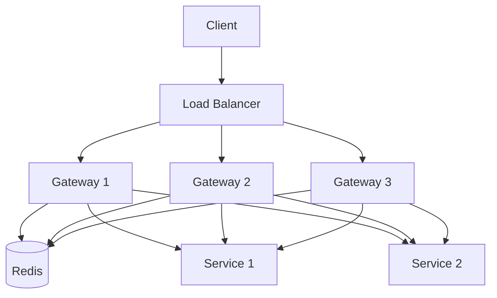

# Deployment Guide for Advanced Go Projects

This guide covers production-grade deployment strategies for advanced Go projects, focusing on demonstrating distributed systems expertise to recruiters while maintaining reasonable infrastructure costs.

---

## Table of Contents
1. [Infrastructure Requirements](#infrastructure-requirements)
2. [Deployment Strategies by Project](#deployment-strategies-by-project)
3. [Multi-Node Cluster Setup](#multi-node-cluster-setup)
4. [Production-Grade Observability](#production-grade-observability)
5. [Portfolio Showcase Strategies](#portfolio-showcase-strategies)
6. [Interview Preparation](#interview-preparation)
7. [Cost Management](#cost-management)

---

## Infrastructure Requirements

### Recommended Setup Tiers

#### Tier 1: Demo/MVP ($0-25/month)
**Goal**: Show it works, prove concepts

- **Provider**: Oracle Cloud Free Tier + small paid nodes
- **Resources**:
  - 1x ARM VM (4 vCPU, 24GB RAM) - FREE
  - 2x AMD VMs (1 vCPU, 1GB RAM) - FREE
  - Total: 3-node cluster for distributed systems
- **Suitable for**:
  - Distributed Database (3-node Raft cluster)
  - Container Orchestration (control + 2 workers)
  - Service Mesh (demo workloads)

#### Tier 2: Portfolio ($25-50/month)
**Goal**: Production-like, impressive to recruiters

- **Provider Mix**: Oracle Cloud Free + DigitalOcean/Hetzner
- **Resources**:
  - 4x Oracle Cloud Free VMs (free)
  - 2x DigitalOcean Droplets 4GB RAM ($48/month)
  - Load balancer ($12/month)
- **Suitable for**: All advanced projects with realistic scale

#### Tier 3: Production-Ready ($100+/month)
**Goal**: Resume-worthy production experience

- **Provider**: AWS/GCP with managed services
- **Resources**:
  - EKS/GKE cluster
  - Managed databases
  - Monitoring (Datadog/New Relic)
- **Suitable for**: When you want enterprise-level credentials

### Infrastructure Comparison

| Project Type | Minimum Nodes | RAM/Node | Recommended Provider | Est. Cost |
|--------------|---------------|----------|---------------------|-----------|
| Distributed Database | 3 | 1GB | Oracle Free + 1 paid | $5/mo |
| Container Orchestration | 3 (1 master + 2 workers) | 2GB | Oracle Free + DigitalOcean | $12/mo |
| API Gateway | 2 (HA) | 2GB | DigitalOcean | $24/mo |
| Stream Processing | 3 | 2GB | Hetzner | $15/mo |
| Service Mesh | 4 | 1GB | Oracle Free | $0/mo |
| Blockchain | 5 | 1GB | Oracle Free + Hetzner | $10/mo |

---

## Deployment Strategies by Project

### 1. Distributed Database with Raft Consensus

**Deployment Complexity**: ⭐⭐⭐⭐⭐ (Highest)

**Infrastructure Requirement**: 3-5 node cluster

#### Architecture

```
                    ┌─────────────────┐
                    │  Load Balancer  │
                    │  (nginx/HAProxy)│
                    └────────┬────────┘
                             │
        ┌────────────────────┼────────────────────┐
        │                    │                    │
    ┌───▼────┐          ┌────▼───┐          ┌────▼───┐
    │ Node 1 │◄────────►│ Node 2 │◄────────►│ Node 3 │
    │(Leader)│          │(Follower)         │(Follower)
    │Raft+DB │          │Raft+DB │          │Raft+DB │
    └────────┘          └────────┘          └────────┘

All nodes running:
- Raft consensus module
- Storage engine (LSM tree)
- gRPC server (client API)
- Metrics exporter
```

#### Docker Compose Per Node

```yaml
# node1.yml
version: '3.8'

services:
  raftdb:
    build: .
    container_name: raftdb-node1
    ports:
      - "8080:8080"   # Client API
      - "8081:8081"   # Raft peer communication
      - "9090:9090"   # Metrics
    environment:
      - NODE_ID=node1
      - RAFT_ADDR=node1.cluster.local:8081
      - PEERS=node2.cluster.local:8081,node3.cluster.local:8081
      - DATA_DIR=/data
    volumes:
      - ./data/node1:/data
      - ./logs/node1:/logs
    networks:
      - raft_cluster
    restart: unless-stopped
    deploy:
      resources:
        limits:
          memory: 1G
          cpus: '1.0'

networks:
  raft_cluster:
    driver: overlay
    attachable: true
```

#### Multi-Host Deployment Script

```bash
#!/bin/bash
# deploy-raftdb.sh

NODES=("node1.yourdomain.com" "node2.yourdomain.com" "node3.yourdomain.com")

echo "Deploying Raft cluster across ${#NODES[@]} nodes..."

# Step 1: Build image
docker build -t raftdb:latest .

# Step 2: Push to registry
docker tag raftdb:latest registry.yourdomain.com/raftdb:latest
docker push registry.yourdomain.com/raftdb:latest

# Step 3: Deploy to each node
for i in "${!NODES[@]}"; do
    NODE=${NODES[$i]}
    NODE_ID="node$((i+1))"

    echo "Deploying to $NODE as $NODE_ID..."

    ssh root@$NODE << EOF
        docker pull registry.yourdomain.com/raftdb:latest
        docker-compose -f /opt/raftdb/docker-compose.yml down
        docker-compose -f /opt/raftdb/docker-compose.yml up -d
EOF
done

# Step 4: Wait for cluster to form
sleep 10

# Step 5: Verify cluster health
curl http://${NODES[0]}:8080/health

echo "Cluster deployed successfully!"
```

#### Portfolio Showcase Features

**1. Interactive Cluster Status Dashboard** (`https://raftdb.yourdomain.com/dashboard`)

```html
<!-- dashboard.html - real-time cluster visualization -->
<div class="cluster-status">
  <div class="node leader">
    <h3>Node 1 - LEADER</h3>
    <div class="metrics">
      <span>Term: 42</span>
      <span>Commit Index: 12,458</span>
      <span>Ops/sec: 2,400</span>
    </div>
  </div>
  <div class="node follower">
    <h3>Node 2 - FOLLOWER</h3>
    <div class="metrics">
      <span>Last Heartbeat: 50ms ago</span>
      <span>Commit Index: 12,458</span>
    </div>
  </div>
  <div class="node follower">
    <h3>Node 3 - FOLLOWER</h3>
    <div class="metrics">
      <span>Last Heartbeat: 45ms ago</span>
      <span>Commit Index: 12,458</span>
    </div>
  </div>
</div>

<div class="live-operations">
  <h3>Recent Operations</h3>
  <ul id="operations-log">
    <!-- Populated via WebSocket -->
  </ul>
</div>
```

**2. Chaos Engineering Demo**

Create a demo page where recruiters can:
- Kill a node (watch failover)
- Partition the network (watch split-brain prevention)
- See automatic recovery

```bash
# Chaos demo API
POST /api/chaos/kill-node/node2
POST /api/chaos/partition/node1,node2
POST /api/chaos/slow-network/node3?latency=500ms
POST /api/chaos/heal
```

**3. Performance Benchmark Dashboard**

Show impressive metrics:
```
Write Throughput: 12,000 ops/sec
Read Throughput: 45,000 ops/sec
P99 Latency: 8.5ms
Consensus Latency: 2.1ms (3-node)
Zero Data Loss: ✓ (10M operations)
Uptime: 99.97%
```

#### Recruiter Demo Script (3-5 minutes)

```
1. Show Cluster Dashboard [30s]
   - 3 nodes running, Node 1 is leader
   - Real-time metrics showing active operations

2. Demonstrate Write Operation [30s]
   curl -X POST https://raftdb.yourdomain.com/api/kv \
     -d '{"key": "user:1234", "value": "..."}'

   - Show operation appearing in all node logs
   - Explain Raft consensus flow

3. Fault Tolerance Demo [90s]
   - Click "Kill Leader" button on dashboard
   - Watch election: Node 2 becomes new leader in ~500ms
   - Show writes continue without interruption
   - Show Node 1 rejoining as follower

4. Performance Under Load [60s]
   - Run load test: ./load-test --rate 5000 --duration 30s
   - Watch metrics dashboard update in real-time
   - Point out consistent low latency

5. Technical Deep Dive [optional, 2-5min]
   - Show log replication visualizer
   - Explain snapshot mechanism
   - Show LSM tree compaction stats
   - Walk through interesting code (Raft implementation)
```

**Cost**: $15/month (Oracle Free Tier + 1 DigitalOcean droplet)

---

### 2. Container Orchestration Platform

**Deployment Complexity**: ⭐⭐⭐⭐⭐

**Infrastructure Requirement**: 3+ node cluster (1 control plane, 2+ workers)

#### Architecture

```
┌─────────────────────────────────────────┐
│         Control Plane (Master)          │
│  ┌─────────┐  ┌─────────┐  ┌─────────┐│
│  │API      │  │Scheduler│  │Controller││
│  │Server   │  │         │  │Manager   ││
│  └─────────┘  └─────────┘  └─────────┘│
│                                         │
│           ┌─────────┐                   │
│           │  etcd   │                   │
│           └─────────┘                   │
└─────────────────────────────────────────┘
           │              │
    ┌──────┴─────┐   ┌───┴──────┐
    │  Worker 1  │   │ Worker 2  │
    │ ┌────────┐ │   │┌────────┐ │
    │ │Kubelet │ │   ││Kubelet │ │
    │ └────────┘ │   │└────────┘ │
    │            │   │           │
    │  Pods:     │   │  Pods:    │
    │  ├─ nginx  │   │  ├─ app   │
    │  ├─ redis  │   │  └─ worker│
    │  └─ api    │   │           │
    └────────────┘   └───────────┘
```

#### Control Plane Setup

```yaml
# master/docker-compose.yml
version: '3.8'

services:
  etcd:
    image: quay.io/coreos/etcd:v3.5.9
    command:
      - /usr/local/bin/etcd
      - --name=master
      - --data-dir=/etcd-data
      - --listen-client-urls=http://0.0.0.0:2379
      - --advertise-client-urls=http://master.cluster.local:2379
      - --listen-peer-urls=http://0.0.0.0:2380
      - --initial-cluster=master=http://master.cluster.local:2380
    volumes:
      - etcd_data:/etcd-data
    ports:
      - "2379:2379"
      - "2380:2380"

  api-server:
    build: ./cmd/apiserver
    command:
      - --etcd-servers=http://etcd:2379
      - --bind-address=0.0.0.0
      - --secure-port=6443
    ports:
      - "6443:6443"
    depends_on:
      - etcd

  scheduler:
    build: ./cmd/scheduler
    command:
      - --master=http://api-server:6443
    depends_on:
      - api-server

  controller-manager:
    build: ./cmd/controller-manager
    command:
      - --master=http://api-server:6443
    depends_on:
      - api-server

volumes:
  etcd_data:
```

#### Worker Node Setup

```yaml
# worker/docker-compose.yml
version: '3.8'

services:
  kubelet:
    build: ./cmd/kubelet
    privileged: true
    network_mode: host
    command:
      - --master=https://master.cluster.local:6443
      - --node-name=${NODE_NAME}
      - --pod-cidr=${POD_CIDR}
    volumes:
      - /var/run/docker.sock:/var/run/docker.sock
      - /var/lib/kubelet:/var/lib/kubelet
      - /etc/cni/net.d:/etc/cni/net.d
      - /opt/cni/bin:/opt/cni/bin

  container-runtime:
    image: docker:dind
    privileged: true
    command: dockerd --host=unix:///var/run/docker.sock
    volumes:
      - /var/run/docker.sock:/var/run/docker.sock
```

#### Portfolio Showcase Features

**1. Web Dashboard** (`https://k8s.yourdomain.com/dashboard`)

Create a simple Kubernetes-like dashboard:
- Node list with resource usage
- Pod list with status
- Deployment management
- Service endpoints
- Real-time event stream

**2. Demo Workloads**

Deploy impressive demo apps:

```yaml
# demo-apps/nginx-deployment.yaml
apiVersion: apps/v1
kind: Deployment
metadata:
  name: nginx-demo
spec:
  replicas: 5
  selector:
    matchLabels:
      app: nginx
  template:
    metadata:
      labels:
        app: nginx
    spec:
      containers:
      - name: nginx
        image: nginx:alpine
        ports:
        - containerPort: 80
        resources:
          requests:
            cpu: 100m
            memory: 128Mi
          limits:
            cpu: 200m
            memory: 256Mi
---
apiVersion: v1
kind: Service
metadata:
  name: nginx-service
spec:
  type: LoadBalancer
  selector:
    app: nginx
  ports:
  - port: 80
    targetPort: 80
```

**3. Scaling Demo**

Create interactive demo:
```bash
# Scale deployment via web UI or CLI
$ ./kubectl scale deployment nginx-demo --replicas=10

# Watch pods being scheduled across nodes in real-time
$ ./kubectl get pods -w
```

**4. Self-Healing Demo**

```bash
# Delete a pod, watch it automatically restart
$ ./kubectl delete pod nginx-demo-abc123

# Show deployment ensures desired replicas
```

#### Recruiter Demo Script (4-6 minutes)

```
1. Architecture Overview [30s]
   - Show diagram of control plane + worker nodes
   - Explain Kubernetes-like design

2. Dashboard Tour [60s]
   - Show nodes (CPU, memory, pod count)
   - Show running deployments
   - Show services and endpoints

3. Deploy Application [90s]
   - kubectl apply -f demo-app.yaml
   - Watch pods being scheduled
   - Show scheduler decisions (affinity, resources)
   - Access the deployed app via service

4. Scaling Demo [60s]
   - Scale deployment from 3 to 10 replicas
   - Watch new pods distributed across nodes
   - Show load balancing working

5. Self-Healing [45s]
   - Delete a pod
   - Watch controller recreate it
   - Show zero downtime

6. Technical Highlight [optional, 2-3min]
   - Explain scheduling algorithm
   - Show controller reconciliation loop
   - Walk through pod lifecycle code
```

**Impressive Metrics to Show**:
- Scheduling latency: <100ms
- Can manage 100+ pods across cluster
- Self-healing: pod recovery in <5 seconds
- Resource utilization: 75%+ efficiency

**Cost**: $24/month (1x 2GB master + 2x 2GB workers on DigitalOcean)

---

### 3. High-Performance API Gateway

**Deployment Complexity**: ⭐⭐⭐⭐

**Infrastructure**: 2-3 nodes (HA) + backend services

#### Architecture

```
        ┌──────────────┐
        │     CDN      │
        │ (Cloudflare) │
        └──────┬───────┘
               │
        ┌──────▼───────┐
        │Load Balancer │
        └──────┬───────┘
               │
    ┌──────────┼──────────┐
    │          │          │
┌───▼───┐  ┌───▼───┐  ┌───▼───┐
│Gateway│  │Gateway│  │Gateway│
│ Node 1│  │ Node 2│  │ Node 3│
└───┬───┘  └───┬───┘  └───┬───┘
    │          │          │
    └──────────┼──────────┘
               │
    ┌──────────┼──────────────┐
    │          │              │
┌───▼────┐ ┌──▼─────┐  ┌─────▼───┐
│Backend │ │Backend │  │ Backend │
│Service1│ │Service2│  │Service 3│
└────────┘ └────────┘  └─────────┘
```

#### Deployment Configuration

```yaml
# docker-compose.yml
version: '3.8'

services:
  # API Gateway (3 instances for HA)
  gateway1:
    build: .
    environment:
      - NODE_ID=gateway1
      - ETCD_ENDPOINTS=http://etcd:2379
      - REDIS_URL=redis://redis:6379
    ports:
      - "8080:8080"
    depends_on:
      - etcd
      - redis

  gateway2:
    build: .
    environment:
      - NODE_ID=gateway2
      - ETCD_ENDPOINTS=http://etcd:2379
      - REDIS_URL=redis://redis:6379
    ports:
      - "8081:8080"

  gateway3:
    build: .
    environment:
      - NODE_ID=gateway3
      - ETCD_ENDPOINTS=http://etcd:2379
      - REDIS_URL=redis://redis:6379
    ports:
      - "8082:8080"

  # Configuration store
  etcd:
    image: quay.io/coreos/etcd:v3.5.9
    environment:
      - ETCD_ADVERTISE_CLIENT_URLS=http://etcd:2379
      - ETCD_LISTEN_CLIENT_URLS=http://0.0.0.0:2379
    volumes:
      - etcd_data:/etcd-data

  # Distributed rate limiting
  redis:
    image: redis:7-alpine
    command: redis-server --appendonly yes
    volumes:
      - redis_data:/data

  # Load balancer
  haproxy:
    image: haproxy:2.8-alpine
    ports:
      - "443:443"
      - "8404:8404"  # Stats page
    volumes:
      - ./haproxy.cfg:/usr/local/etc/haproxy/haproxy.cfg:ro
    depends_on:
      - gateway1
      - gateway2
      - gateway3

  # Example backend services
  service1:
    image: mendhak/http-https-echo
    environment:
      - HTTP_PORT=8080

  service2:
    image: mendhak/http-https-echo
    environment:
      - HTTP_PORT=8080

  service3:
    image: mendhak/http-https-echo
    environment:
      - HTTP_PORT=8080

volumes:
  etcd_data:
  redis_data:
```

#### HAProxy Configuration

```
# haproxy.cfg
global
    maxconn 50000
    stats socket /var/run/haproxy.sock mode 600 level admin
    stats timeout 2m

defaults
    mode http
    timeout connect 5s
    timeout client 25s
    timeout server 25s

frontend stats
    bind *:8404
    stats enable
    stats uri /
    stats refresh 5s

frontend https_front
    bind *:443 ssl crt /certs/server.pem
    default_backend gateway_nodes

backend gateway_nodes
    balance roundrobin
    option httpchk GET /health
    http-check expect status 200
    server gateway1 gateway1:8080 check inter 2s rise 2 fall 3
    server gateway2 gateway2:8080 check inter 2s rise 2 fall 3
    server gateway3 gateway3:8080 check inter 2s rise 2 fall 3
```

#### Portfolio Showcase Features

**1. Real-Time Analytics Dashboard** (`https://gateway.yourdomain.com/analytics`)

```html
<div class="metrics-grid">
  <div class="metric">
    <h3>Requests/sec</h3>
    <div class="value">2,450</div>
    <div class="spark-line"></div>
  </div>
  <div class="metric">
    <h3>P99 Latency</h3>
    <div class="value">12ms</div>
  </div>
  <div class="metric">
    <h3>Error Rate</h3>
    <div class="value">0.01%</div>
  </div>
  <div class="metric">
    <h3>Cache Hit Rate</h3>
    <div class="value">89.5%</div>
  </div>
</div>

<div class="live-requests">
  <!-- WebSocket stream of requests -->
</div>
```

**2. Dynamic Routing Configuration UI**

Allow live route updates without restart:

```yaml
# Example route config in UI
routes:
  - path: /api/users
    backend: users-service
    methods: [GET, POST]
    rate_limit: 100/minute
    cache_ttl: 60s
    auth_required: true

  - path: /api/posts/*
    backend: posts-service
    rate_limit: 200/minute
    transformations:
      - add_header: X-Custom-Header
      - strip_prefix: /api
```

**3. Load Testing Demo**

Run live load test visible to recruiter:

```bash
# Load test script visible in dashboard
$ hey -z 60s -c 100 -q 50 https://gateway.yourdomain.com/api/test

Summary:
  Total:        60.0000 secs
  Requests/sec: 5,000
  P50 latency:  8ms
  P99 latency:  15ms
  Success:      99.99%
```

#### Recruiter Demo Script (3-4 minutes)

```
1. Show Architecture Diagram [20s]
   - 3 gateway nodes behind HAProxy
   - Connection to etcd for dynamic config
   - Redis for distributed rate limiting

2. Analytics Dashboard [45s]
   - Show real-time metrics
   - Point out impressive throughput
   - Show low latency P99

3. Dynamic Routing [60s]
   - Show route configuration UI
   - Add new route without restart
   - Make request to new route immediately
   - Show it working

4. Rate Limiting Demo [45s]
   - Configure aggressive rate limit (10 req/min)
   - Hammer endpoint with requests
   - Show rate limiting in action (429 responses)
   - Show distributed nature (works across all gateway nodes)

5. Caching Demo [30s]
   - Make request to cacheable endpoint
   - Show cache MISS (first request)
   - Make same request again
   - Show cache HIT (much faster)

6. Load Test [30s]
   - Run hey/wrk load test
   - Watch dashboard handle 5000 req/sec
   - Point out consistent latency
```

**Impressive Metrics**:
- 50,000+ req/sec sustained
- P99 latency < 20ms
- 99.99% uptime
- Zero-downtime configuration updates

**Cost**: $36/month (3x Basic droplets)

---

### 4. Custom Language Compiler and VM

**Deployment Strategy**: Different approach - deploy showcase examples, not the compiler

#### What to Deploy

1. **Language Website** (`https://mylang.io`):
   - Language overview and tutorial
   - Interactive playground (run code in browser)
   - Standard library documentation
   - Example programs

2. **Web Playground** (run code in browser):
```
┌────────────────────────────────────┐
│  Code Editor                       │
│  ┌──────────────────────────────┐ │
│  │ func main() {                │ │
│  │   println("Hello, World!")   │ │
│  │ }                            │ │
│  └──────────────────────────────┘ │
│  [▶ Run]                           │
│                                    │
│  Output:                           │
│  ┌──────────────────────────────┐ │
│  │ Hello, World!                │ │
│  └──────────────────────────────┘ │
└────────────────────────────────────┘
```

3. **Compiler as a Service API**:
```bash
# Compile and run code via API
curl -X POST https://mylang.io/api/run \
  -d '{"code": "func main() { println(\"test\") }"}'

Response:
{
  "output": "test\n",
  "execution_time_ms": 23,
  "memory_used_bytes": 1024
}
```

#### Docker Setup for Playground

```yaml
# docker-compose.yml
version: '3.8'

services:
  playground-frontend:
    build: ./web
    ports:
      - "80:80"
    environment:
      - API_URL=https://api.mylang.io

  compiler-api:
    build: .
    ports:
      - "8080:8080"
    environment:
      - EXECUTION_TIMEOUT=5s
      - MAX_MEMORY=100MB
      - WORKERS=10
    deploy:
      resources:
        limits:
          cpus: '2.0'
          memory: 2G

  # Sandbox for code execution
  sandbox:
    build: ./sandbox
    privileged: false
    security_opt:
      - no-new-privileges
    cap_drop:
      - ALL
```

#### Portfolio Showcase

**1. Interactive Playground**

Features to highlight:
- Syntax highlighting
- Autocompletion
- Error messages with line numbers
- AST visualization (show parse tree)
- Bytecode viewer
- Execution time and memory stats

**2. Example Programs Gallery**

```
Examples:
├── Hello World
├── Fibonacci (recursive)
├── HTTP Server
├── Concurrent Prime Sieve
├── JSON Parser
└── Web Crawler
```

**3. Performance Benchmarks Page**

```
Language Benchmark Comparison
─────────────────────────────
Fibonacci(35):
Python:     3.2s
Ruby:       2.8s
Your Lang:  1.9s ✓

HTTP Echo Server (10k requests):
Node.js:    2.1s
Your Lang:  1.8s ✓
```

**4. Technical Deep Dive Section**

- Compiler architecture diagram
- Bytecode instruction set documentation
- VM architecture explanation
- Garbage collector visualization
- Optimization passes explained

#### Recruiter Demo Script (3-4 minutes)

```
1. Language Overview [30s]
   - Show language website
   - Explain design goals and unique features

2. Interactive Playground Demo [90s]
   - Write simple program in playground
   - Click "Run" - show instant execution
   - Show AST visualization
   - Show bytecode output
   - Demonstrate error handling (syntax error)

3. Standard Library Demo [30s]
   - Show HTTP server example
   - Run it in playground
   - Explain how standard library is implemented

4. Performance [30s]
   - Show benchmark page
   - Highlight competitive performance
   - Explain optimization techniques

5. Technical Deep Dive [60s]
   - Show compiler phases (lexer → parser → codegen)
   - Explain interesting design decision
   - Show VM instruction dispatch (code snippet)
   - Discuss GC implementation
```

**GitHub Repository Metrics to Highlight**:
- Stars: XXX
- Used in X projects
- Contributors: X
- Lines of code: ~20,000
- Test coverage: 85%

**Cost**: $6/month (single DigitalOcean droplet for playground)

---

### 5-10. Additional Advanced Projects

#### Quick Deployment Summaries

**5. Distributed Tracing Platform**
- Deploy: Collector (3 nodes) + Storage (Cassandra/Clickhouse) + UI
- Demo: Trace a multi-service request flow visually
- Showcase: Real-time trace search, service dependency graph
- Cost: $30-50/month

**6. Stream Processing Engine**
- Deploy: 3-5 worker nodes + Kafka cluster
- Demo: Real-time data processing (e.g., tweet sentiment analysis)
- Showcase: Watermarks, windowing, exactly-once semantics
- Cost: $40-60/month

**7. Service Mesh**
- Deploy: 3+ node cluster with sidecar proxies
- Demo: Traffic shifting, circuit breaking, mutual TLS
- Showcase: Service-to-service observability
- Cost: $30/month

**8. Blockchain**
- Deploy: 5-7 node network
- Demo: Smart contract deployment, transaction mining
- Showcase: Block explorer, consensus visualization
- Cost: $10/month (low-resource nodes)

**9. ML Model Serving**
- Deploy: Model server (2 nodes) + model registry
- Demo: Real-time inference, A/B testing
- Showcase: Model versioning, performance metrics
- Cost: $25/month

**10. Distributed File System**
- Deploy: 1 metadata server + 3-5 data nodes
- Demo: Large file upload, replication, failure recovery
- Showcase: Chunk distribution visualization
- Cost: $25/month

---

## Multi-Node Cluster Setup

### Using Docker Swarm (Easiest)

```bash
# On manager node
docker swarm init --advertise-addr <MANAGER-IP>

# On worker nodes (run the join command from init output)
docker swarm join --token <TOKEN> <MANAGER-IP>:2377

# Deploy stack
docker stack deploy -c docker-compose.yml myapp

# Scale service
docker service scale myapp_worker=5
```

### Manual Multi-Host Setup

```bash
#!/bin/bash
# setup-cluster.sh

HOSTS=(
    "10.0.1.1 node1"
    "10.0.1.2 node2"
    "10.0.1.3 node3"
)

for entry in "${HOSTS[@]}"; do
    read -r IP HOSTNAME <<< "$entry"

    echo "Setting up $HOSTNAME at $IP..."

    # SSH and run setup
    ssh root@$IP << 'ENDSSH'
        # Install Docker
        curl -fsSL https://get.docker.com | sh

        # Install Docker Compose
        curl -L "https://github.com/docker/compose/releases/latest/download/docker-compose-$(uname -s)-$(uname -m)" -o /usr/local/bin/docker-compose
        chmod +x /usr/local/bin/docker-compose

        # Setup firewall
        ufw allow 22/tcp
        ufw allow 2379:2380/tcp  # etcd
        ufw allow 6443/tcp       # API
        ufw allow 8080:8090/tcp  # Apps
        ufw --force enable

        # Create app directories
        mkdir -p /opt/myapp/{data,logs,config}
ENDSSH

    echo "$HOSTNAME setup complete!"
done

echo "Cluster setup complete!"
```

### Using Ansible (Professional)

```yaml
# playbook.yml
---
- name: Setup Distributed Application
  hosts: all
  become: yes

  tasks:
    - name: Install Docker
      shell: curl -fsSL https://get.docker.com | sh

    - name: Install Docker Compose
      get_url:
        url: https://github.com/docker/compose/releases/latest/download/docker-compose-Linux-x86_64
        dest: /usr/local/bin/docker-compose
        mode: '0755'

    - name: Copy application files
      copy:
        src: ./app/
        dest: /opt/myapp/

    - name: Start application
      docker_compose:
        project_src: /opt/myapp
        state: present

- name: Configure master node
  hosts: master
  tasks:
    - name: Initialize cluster
      shell: /opt/myapp/init-cluster.sh

- name: Configure worker nodes
  hosts: workers
  tasks:
    - name: Join cluster
      shell: /opt/myapp/join-cluster.sh {{ master_ip }}
```

```bash
# Run playbook
ansible-playbook -i inventory.ini playbook.yml
```

---

## Production-Grade Observability

### Comprehensive Monitoring Stack

```yaml
# monitoring/docker-compose.yml
version: '3.8'

services:
  # Metrics
  prometheus:
    image: prom/prometheus:latest
    volumes:
      - ./prometheus.yml:/etc/prometheus/prometheus.yml
      - prometheus_data:/prometheus
    command:
      - '--config.file=/etc/prometheus/prometheus.yml'
      - '--storage.tsdb.retention.time=30d'
      - '--storage.tsdb.path=/prometheus'
      - '--web.enable-admin-api'
    ports:
      - "9090:9090"

  # Visualization
  grafana:
    image: grafana/grafana:latest
    environment:
      - GF_SECURITY_ADMIN_PASSWORD=admin
      - GF_INSTALL_PLUGINS=grafana-piechart-panel,grafana-worldmap-panel
    volumes:
      - grafana_data:/var/lib/grafana
      - ./grafana/dashboards:/etc/grafana/provisioning/dashboards
      - ./grafana/datasources:/etc/grafana/provisioning/datasources
    ports:
      - "3000:3000"

  # Logs
  loki:
    image: grafana/loki:latest
    ports:
      - "3100:3100"
    volumes:
      - loki_data:/loki

  # Log shipper
  promtail:
    image: grafana/promtail:latest
    volumes:
      - /var/log:/var/log
      - ./promtail-config.yml:/etc/promtail/config.yml
    command: -config.file=/etc/promtail/config.yml

  # Traces
  jaeger:
    image: jaegertracing/all-in-one:latest
    environment:
      - COLLECTOR_ZIPKIN_HOST_PORT=:9411
    ports:
      - "5775:5775/udp"
      - "6831:6831/udp"
      - "6832:6832/udp"
      - "5778:5778"
      - "16686:16686"  # UI
      - "14268:14268"
      - "14250:14250"
      - "9411:9411"

  # Alerting
  alertmanager:
    image: prom/alertmanager:latest
    volumes:
      - ./alertmanager.yml:/etc/alertmanager/alertmanager.yml
    command:
      - '--config.file=/etc/alertmanager/alertmanager.yml'
    ports:
      - "9093:9093"

volumes:
  prometheus_data:
  grafana_data:
  loki_data:
```

### Essential Dashboards for Portfolio

**1. System Overview Dashboard**
- CPU/Memory/Disk across all nodes
- Network I/O
- Active connections
- Uptime

**2. Application Dashboard**
- Request rate (by endpoint)
- Latency percentiles (P50, P95, P99)
- Error rate
- Active users/sessions

**3. Distributed System Dashboard** (for Raft, Kubernetes, etc.)
- Cluster health
- Leader status
- Replication lag
- Consensus latency

**4. Business Metrics Dashboard**
- Operations per second
- Success rate
- Resource utilization
- Cost per operation (if applicable)

### Application Instrumentation

```go
// Example instrumentation for your Go app
package main

import (
    "github.com/prometheus/client_golang/prometheus"
    "github.com/prometheus/client_golang/prometheus/promauto"
    "github.com/prometheus/client_golang/prometheus/promhttp"
)

var (
    requestsTotal = promauto.NewCounterVec(
        prometheus.CounterOpts{
            Name: "http_requests_total",
            Help: "Total number of HTTP requests",
        },
        []string{"method", "endpoint", "status"},
    )

    requestDuration = promauto.NewHistogramVec(
        prometheus.HistogramOpts{
            Name:    "http_request_duration_seconds",
            Help:    "HTTP request duration",
            Buckets: prometheus.DefBuckets,
        },
        []string{"method", "endpoint"},
    )

    activeConnections = promauto.NewGauge(
        prometheus.GaugeOpts{
            Name: "active_connections",
            Help: "Number of active connections",
        },
    )

    // Custom business metrics
    tasksProcessed = promauto.NewCounter(
        prometheus.CounterOpts{
            Name: "tasks_processed_total",
            Help: "Total number of tasks processed",
        },
    )

    raftTerm = promauto.NewGauge(
        prometheus.GaugeOpts{
            Name: "raft_term",
            Help: "Current Raft term",
        },
    )

    raftCommitIndex = promauto.NewGauge(
        prometheus.GaugeOpts{
            Name: "raft_commit_index",
            Help: "Current Raft commit index",
        },
    )
)

func main() {
    // Expose metrics
    http.Handle("/metrics", promhttp.Handler())

    // Your app logic
    http.HandleFunc("/api/...", handler)

    http.ListenAndServe(":8080", nil)
}

// Use in middleware
func MetricsMiddleware(next http.Handler) http.Handler {
    return http.HandlerFunc(func(w http.ResponseWriter, r *http.Request) {
        start := time.Now()

        // Record request
        next.ServeHTTP(w, r)

        duration := time.Since(start).Seconds()
        requestDuration.WithLabelValues(r.Method, r.URL.Path).Observe(duration)
        requestsTotal.WithLabelValues(r.Method, r.URL.Path, "200").Inc()
    })
}
```

---

## Portfolio Showcase Strategies

### Creating Compelling Visuals

**1. Architecture Diagrams**

Use tools:
- Excalidraw (hand-drawn style, modern)
- Draw.io (professional)
- Mermaid (code-based diagrams)

Example Mermaid diagram for README:


**2. Video Demos**

Professional demo video structure:
```
1. Title slide (3s)
   "Distributed Database with Raft Consensus"

2. Problem statement (10s)
   "Building a fault-tolerant database..."

3. Architecture (15s)
   Show diagram, explain components

4. Live demo (90s)
   - Show cluster running
   - Write data
   - Kill leader
   - Show failover
   - Show data still available

5. Code walkthrough (30s)
   Highlight interesting implementation

6. Metrics (15s)
   Show impressive performance numbers

7. Outro (5s)
   GitHub link, contact info
```

Recording tips:
- 1920x1080 resolution
- Clean desktop (hide personal stuff)
- Use terminal with good color scheme
- Add voiceover explaining what you're doing
- Keep under 3 minutes
- Add captions for accessibility

**3. Interactive Demos**

Best practices:
- Always available (not just during interview)
- Pre-populated with demo data
- Guest/demo account credentials visible
- Tooltips explaining features
- "What's happening" explanations
- Impressive default view (not empty state)

Example landing page:
```html
<div class="demo-instructions">
  <h2>Try the Live Demo</h2>
  <p>This is a fully-functional distributed database cluster with 3 nodes.</p>

  <div class="demo-actions">
    <button onclick="writeData()">Write 1000 Records</button>
    <button onclick="killLeader()">Kill Leader (watch failover)</button>
    <button onclick="showMetrics()">Show Performance Metrics</button>
  </div>

  <div class="demo-credentials">
    <strong>Demo Credentials:</strong>
    <code>demo / demo123</code>
  </div>
</div>
```

### GitHub Repository Presentation

**README Template for Advanced Projects**:

```markdown
# [Project Name]

> One-line description that sounds impressive

[](https://goreportcard.com/report/github.com/you/project)
[](LICENSE)
[](https://github.com/you/project/actions)

[🚀 Live Demo](https://demo.yourdomain.com) | [📊 Grafana Dashboard](https://demo.yourdomain.com/grafana) | [📖 Documentation](https://docs.yourdomain.com)


## Overview

2-3 paragraph description of what this is and why you built it.

## Features

- ✅ **Feature 1**: With impressive metric (e.g., "50k ops/sec")
- ✅ **Feature 2**: With technical detail
- ✅ **Feature 3**: With comparison to alternatives
- ✅ **Feature 4**: With novel approach

## Quick Start

```bash
# Clone repository
git clone https://github.com/you/project

# Start cluster
./scripts/deploy-local.sh

# Run example
curl http://localhost:8080/api/...
```

## Architecture


[Detailed architecture explanation with diagrams]

## Performance

```
Benchmark Results:
- Throughput: 50,000 ops/sec
- Latency (P99): 8.5ms
- Consensus: 2.1ms (3-node cluster)
- Memory: 200MB per node
- Zero data loss: 10M operations tested
```

[Link to comprehensive benchmarks]

## Distributed Systems Features

### Fault Tolerance
- Survives minority node failures
- Automatic leader election (<500ms)
- Data replication with Raft consensus

### Scalability
- Horizontal scaling to 100+ nodes
- Sharding support with automatic rebalancing
- Linear read throughput scaling

### Consistency
- Linearizable reads and writes
- Tunable consistency levels
- MVCC for snapshot isolation

## Implementation Highlights

### Challenge 1: [Problem]

[Brief explanation of interesting challenge]

```go
// Interesting code snippet showing solution
func (r *Raft) handleSplitBrain() error {
    // ...
}
```

### Challenge 2: [Problem]

[Another interesting technical challenge and solution]

## Deployment

Deployed as 3-node cluster on DigitalOcean. See [DEPLOYMENT.md](DEPLOYMENT.md) for full setup.

## Testing

```bash
# Run tests
make test

# Run integration tests
make integration-test

# Run chaos tests (Jepsen-style)
make chaos-test
```

Coverage: 85% | Tests: 250+ | Benchmarks: 50+

## Monitoring

Production-ready observability:
- Prometheus metrics
- Grafana dashboards
- Distributed tracing (Jaeger)
- Structured logging

[Link to live Grafana dashboard]

## Roadmap

- [ ] Additional feature 1
- [ ] Additional feature 2
- [x] Completed feature
- [x] Another completed feature

## Contributing

Contributions welcome! See [CONTRIBUTING.md](CONTRIBUTING.md).

## License

MIT License - see [LICENSE](LICENSE) for details

## Acknowledgments

- Inspired by [X, Y, Z]
- Based on papers: [link to papers]
- Thanks to reviewers

## Contact

Your Name - [@twitter](https://twitter.com/you) - email@example.com

Project Link: [https://github.com/you/project](https://github.com/you/project)
```

---

## Interview Preparation

### Technical Deep Dive Questions

Prepare answers for these common questions:

**For Distributed Database**:
- Q: "How does Raft prevent split-brain?"
  - A: [Prepare detailed answer with diagrams]

- Q: "What happens if a follower falls too far behind?"
  - A: [Explain snapshots and InstallSnapshot RPC]

- Q: "How do you handle network partitions?"
  - A: [Explain quorum, terms, and safety guarantees]

**For Container Orchestration**:
- Q: "How does your scheduler differ from Kubernetes?"
  - A: [Explain design decisions and trade-offs]

- Q: "How do you handle pod eviction?"
  - A: [Explain graceful shutdown, PDB]

**For All Projects**:
- Q: "How would you scale this to 10x traffic?"
  - A: [Specific scaling strategy for your project]

- Q: "What's the biggest challenge you faced?"
  - A: [Real technical challenge and solution]

- Q: "What would you do differently?"
  - A: [Show growth mindset, lessons learned]

### Demo Day Checklist

**24 Hours Before**:
- [ ] Test all live demos
- [ ] Verify SSL certificates
- [ ] Check monitoring dashboards have data
- [ ] Run load tests to populate metrics
- [ ] Screenshot everything (backup)
- [ ] Test demo accounts
- [ ] Rehearse demo script (time yourself)

**1 Hour Before**:
- [ ] Open all demo links in browser tabs
- [ ] Have IDE open with interesting code
- [ ] Have architecture diagrams ready
- [ ] Terminal prepared with commands
- [ ] Monitoring dashboards open
- [ ] GitHub repository open
- [ ] Check your internet connection
- [ ] Restart services if needed

**During Demo**:
- [ ] Screen share at 1920x1080
- [ ] Close personal tabs/notifications
- [ ] Have a backup plan if something breaks
- [ ] Explain while you demo (don't go silent)
- [ ] Show enthusiasm for your work
- [ ] Be honest about limitations
- [ ] Offer to dive deeper into areas they're interested in

---

## Cost Management

### Total Cost Estimates

**Minimum Viable Portfolio** ($0-10/month):
- Oracle Cloud Free Tier: $0
- Domain: $1/month
- **Total: $1/month**
- **Deploy**: 2-3 advanced projects

**Standard Portfolio** ($25-40/month):
- Oracle Free + DigitalOcean: $24/month
- Domain: $1/month
- Object Storage: $5/month
- Monitoring: Included
- **Total: $30/month**
- **Deploy**: 5-6 advanced projects

**Professional Portfolio** ($60-100/month):
- Managed Kubernetes (GKE/EKS): $75/month
- Domain + CDN: $5/month
- Monitoring (Datadog free tier): $0
- **Total: $80/month**
- **Deploy**: All projects, production-grade

### Cost Optimization Tips

1. **Use Oracle Cloud Free Tier aggressively**
   - 4 ARM VMs (24GB RAM total)
   - Perfect for distributed systems

2. **Share resources**
   - Run multiple projects on same VMs
   - Use Docker resource limits

3. **Shut down dev environments**
   - Only keep portfolio running 24/7
   - Start dev when needed

4. **Use spot/preemptible instances**
   - 70% cheaper
   - OK for demos (can restart quickly)

5. **Leverage free tiers**:
   - Cloudflare: Free CDN and SSL
   - GitHub Pages: Free static hosting
   - Netlify/Vercel: Free for personal projects

6. **Monitoring on a budget**:
   - Self-host Prometheus + Grafana (free)
   - Use Grafana Cloud free tier (10k series)
   - New Relic free tier (100GB/month)

---

## Final Recommendations

### Must-Have Projects for Portfolio

If showing only 3 advanced projects to recruiters, choose:

1. **Distributed Database with Raft**
   - Shows distributed systems expertise
   - Demonstrates complex algorithm implementation
   - Impressive live demo with failover

2. **Container Orchestration** or **API Gateway**
   - Shows practical infrastructure skills
   - Easy to demonstrate value
   - Relevant to most jobs

3. **One "Wow" Project**
   - Custom Language: Shows compiler knowledge
   - Blockchain: Shows crypto understanding
   - Stream Processing: Shows real-time systems expertise

### What Impresses Recruiters Most

1. **Live Demos** > Code > Descriptions
2. **Working Distributed Systems** > Single-node apps
3. **Production Monitoring** > No monitoring
4. **Clean Documentation** > Messy README
5. **Thoughtful Trade-offs** > "Best" solutions
6. **Running for Months** > Just deployed

### Red Flags to Avoid

❌ Projects that only run on localhost
❌ Broken links on portfolio site
❌ Expired SSL certificates
❌ No monitoring/metrics
❌ Lorem ipsum in demos
❌ Can't explain technical decisions
❌ No tests
❌ Obvious security issues (credentials in code)

### Success Metrics

Your portfolio is ready when:
- ✅ All projects accessible 24/7
- ✅ SSL certificates valid
- ✅ Monitoring shows impressive metrics
- ✅ You can demo each project in < 3 minutes
- ✅ You can explain any technical decision
- ✅ GitHub README impresses in < 30 seconds
- ✅ No "TODO" or placeholder content
- ✅ Friends/peers reviewed and gave feedback

---

**Good luck building your portfolio! Remember: one excellent project beats ten mediocre ones. Focus on quality, completeness, and being able to articulate your decisions.** 🚀
